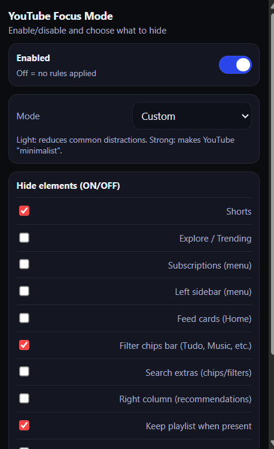

<p align="center">
  
</p>

<h1 align="center">YouTube Focus Mode</h1>

<p align="center">
  <strong>Eliminate distractions. Stay focused. Watch what matters.</strong>
</p>

<p align="center">
  <a href="#-features">Features</a>&nbsp;&nbsp;&nbsp;|&nbsp;&nbsp;&nbsp;
  <a href="#-installation">Installation</a>&nbsp;&nbsp;&nbsp;|&nbsp;&nbsp;&nbsp;
  <a href="#-how-to-use">How to Use</a>&nbsp;&nbsp;&nbsp;|&nbsp;&nbsp;&nbsp;
  <a href="#-technologies">Technologies</a>&nbsp;&nbsp;&nbsp;|&nbsp;&nbsp;&nbsp;
  <a href="#-privacy">Privacy</a>
</p>

<p align="center">
  
  
  
</p>

---

## 🎯 About

**YouTube Focus Mode** is a Chrome extension designed to help you stay focused while using YouTube. It removes distracting elements like Shorts, sponsored ads, recommendations, comments, and more — so you can concentrate on the content that truly matters to you.

Perfect for students, professionals, and anyone who wants a cleaner, distraction-free YouTube experience.

---

## ✨ Features

| Feature | Description |
|---------|-------------|
| 🎬 **Hide Shorts** | Removes all Shorts from feed, sidebar, and channel pages |
| 🚫 **Block Sponsored Ads** | Hides promoted videos and banner ads in the feed |
| 📊 **Hide Filter Chips** | Removes the "All", "Music", "Mixes" filter bar |
| 🧭 **Hide Explore/Trending** | Removes Explore and Trending from sidebar menu |
| 📺 **Hide Home Feed** | Completely hides the home page recommendations |
| 💬 **Hide Comments** | Removes the comments section from videos |
| 👉 **Hide Right Column** | Removes "Up Next" and related video suggestions |
| 🎴 **Hide Endscreen Cards** | Removes end-of-video overlays and cards |
| 📌 **Keep Playlists** | Option to preserve playlists while hiding recommendations |
| ⚡ **Light/Strong Modes** | Pre-configured profiles for quick setup |
| 🎨 **Custom Mode** | Fine-tune exactly what you want to hide |

---

## 🚀 Installation

### From Source (Developer Mode)

1. **Clone or download** this repository:
```bash
git clone https://github.com/eltonsantos/youtube-focus-mode.git
```

2. Open Chrome and go to `chrome://extensions/`

3. Enable **Developer mode** (toggle in top-right corner)

4. Click **"Load unpacked"** and select the project folder

5. The extension icon will appear in your toolbar — you're ready to go!

---

## 💡 How to Use

1. Click the **YouTube Focus Mode** icon in your Chrome toolbar

2. Toggle the **Enabled** switch to activate/deactivate the extension

3. Choose a mode:
   - **Light**: Removes common distractions (Shorts, ads, chips)
   - **Strong**: Maximum focus (hides almost everything except player)
   - **Custom**: Manually select what to hide

4. Each checkbox applies changes **instantly** — no need to click a button!

5. Refresh YouTube if needed after first installation

---

## 🔖 Screenshots

<p align="center">
  
</p>

---

## 🧪 Technologies

This extension was built with:

- **JavaScript** (Vanilla JS, no frameworks)
- **Chrome Extensions API** (Manifest V3)
- **CSS3** (Custom styling with CSS variables)
- **Chrome Storage API** (Sync settings across devices)

---

## 🔒 Privacy

Your privacy matters. This extension:

- ✅ Does **NOT** collect any personal data
- ✅ Does **NOT** track your browsing history
- ✅ Does **NOT** send any data to external servers
- ✅ Works **100% locally** on your browser
- ✅ Only requires access to `youtube.com`

All settings are stored locally using Chrome's sync storage.

---

## 📋 Changelog

### v1.3.0
- Added sponsored/promoted ads blocking
- Added filter chips bar hiding
- Improved Shorts hiding (complete removal)
- UI improvements and bug fixes

### v1.2.0
- Added more hide options
- Fixed MutationObserver performance issues

### v1.0.0
- Initial release

---

## 🐾 Next Steps

- [ ] Publish to Chrome Web Store
- [ ] Add keyboard shortcuts
- [ ] Add scheduled focus mode (time-based)
- [ ] Firefox compatibility
- [ ] Edge compatibility

---

## 👨🏻‍💻 Author

<h3 align="center">
  
  <br/>
  <strong>Elton Santos</strong> 🚀
  <br/>
  <br/>

  <a href="https://www.linkedin.com/in/eltonmelosantos" alt="LinkedIn" target="blank">
    
  </a>

  <a href="https://github.com/eltonsantos" alt="GitHub" target="blank">
    
  </a>

  <a href="https://www.youtube.com/@eltonsantosoficial" alt="YouTube" target="blank">
    
  </a>

  <a href="mailto:elton.melo.santos@gmail.com?subject=Hello%20Elton" alt="Email" target="blank">
    
  </a>

  <a href="https://eltonmelosantos.com.br" alt="Website" target="blank">
    
  </a>

<br/>
<br/>

Made with ❤️ by Elton Santos 👋🏽 [Contact me!](https://www.linkedin.com/in/eltonmelosantos/)

</h3>

---

## 📝 License

This project is licensed under the MIT License - see the [LICENSE](LICENSE) file for details.
